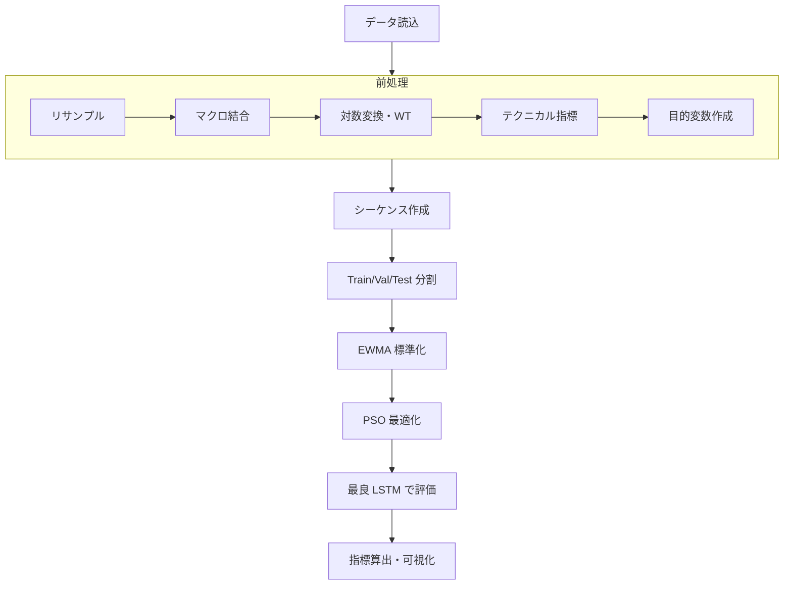
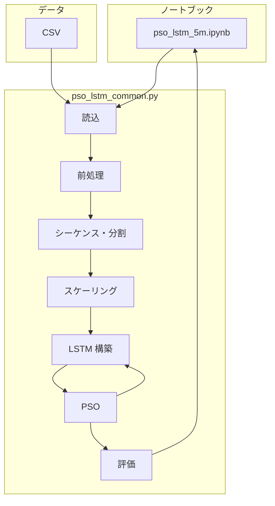

# 1. 基本設計

本プロジェクトは、論文「**Enhancing stock index prediction: A hybrid LSTM-PSO model for improved forecasting accuracy**」を参考にした設計である。PSO（粒子群最適化）で LSTM のハイパーパラメータを最適化し、**5分足の終値**を予測するハイブリッドモデルを実装する。

- 詳細設計（理論）→ [02_detailed_design_theory.md](02_detailed_design_theory.md)  
- 詳細設計（実装）→ [03_detailed_design_implementation.md](03_detailed_design_implementation.md)

---

## 1.1 本プロジェクトの概要

### プロジェクトの目的

- **目的変数**: USD/JPY の **対数収益**を予測する。**何本先**で学習・推論するかは共通パラメータ **TARGET_HORIZON**（デフォルト 6）で指定する。
- **手法**: LSTM による時系列予測と、粒子群最適化（PSO）による LSTM のハイパーパラメータ（ユニット数・層数・エポック数）の探索を組み合わせたハイブリッドモデルを実装する。
- **粒度**: 5分足の為替データを対象とする。

予測結果は対数収益のスケールで評価し、可視化時には必要に応じて終値（価格スケール）に復元して表示する。

### 参考論文と本実装の対応関係

| 論文の要素 | 本実装での対応 |
|------------|----------------|
| LSTM による時系列予測 | LSTM で説明変数シーケンスから TARGET_HORIZON 本先の対数収益を予測 |
| PSO によるハイパーパラメータ探索 | ニューロン数・隠れ層数・エポック数を PSO で探索 |
| 目的関数 | 検証データでの RMSE を最小化 |
| 株価指数 | USD/JPY 為替（5分足）に適用 |

本実装では、論文の枠組みを維持しつつ、データソース（CSV／将来はリアルタイム）、前処理（ウェーブレット、テクニカル指標、正規化）、評価指標をプロジェクト要件に合わせて定義する。

### 金融データの特徴と課題と解決策（概要）

#### 金融時系列の特徴（用語の説明）

為替や株価などの金融データは、一般的な時系列データとは異なり、次のような性質を持っている。

- **非定常性**: 平均や分散が時間とともに変わっていく性質。価格そのものは「だいたいこのあたり」という中心が長期的にずれていくため、そのままでは統計的な予測が難しい。
- **ノイズ**: 値動きのうち、本質的なトレンドやパターンではなく、ランダムに近い細かい変動。為替は短い時間ではノイズが多く、本当のシグナルとノイズの区別が難しい。
- **非線形性**: 原因と結果が単純な比例関係にならない性質。例えば「昨日上がったから今日は下がる」のような、直線では表せない複雑な関係が多く含まれる。
- **ボラティリティのクラスタリング**: 変動の大きさ（ボラティリティ）が、ある期間は小さく、別の期間は大きくなるように「固まって」現れる傾向。荒れた相場のあとはしばらく荒れやすく、落ち着いたあとは落ち着きやすい、といったまとまりがある。
- **極端な外れ値（ブラックスワン）**: 通常の変動の範囲を大きく超えた、ごくまれな急変。歴史的に想定外とされた事象（ブラックスワン）に由来する急騰・急落が含まれると、モデルがその一点に引きずられやすくなる。
- **取引時間・曜日による周期性**: 取引所の営業時間や曜日（週末・祝日休みなど）の影響で、値動きに「同じようなパターン」が繰り返し現れる性質。時間帯や曜日を考慮しないと、この繰り返しを活かせない。

#### それに伴う課題（用語の説明）

上記の特徴により、機械学習で予測する際には次のような問題が起きやすい。

- **過学習**: モデルが「過去のデータにだけぴったり合わせた」状態になり、未知のデータ（将来や別期間）では性能が落ちること。金融データはノイズや非線形性が強いため、過学習しやすい。
- **外れ値の影響**: まれに起きる極端な値（ブラックスワンなど）にモデルが強く反応し、通常時の予測が歪んだり、学習が不安定になったりすること。
- **データ不足**: 本当にまれな事象や、長いスパンのパターンを学ぶにはデータ量が足りない、という問題。5分足でも長期間必要になる。
- **スケールの変動**: 相場の荒れ方（ボラティリティ）が時期で変わるため、データの「大きさ」の基準が一定でなく、そのままではモデルが扱いづらいこと。
- **カレンダー効果の無視**: 曜日や時間帯による周期性を考慮しないと、例えば「月曜朝の動き」と「金曜夕方の動き」を同じ扱いにしてしまい、実際のリズムを反映できないこと。

#### 本プロジェクトで採用する解決策の概要

上記の特徴と課題を踏まえ、本プロジェクトでは次の方針で対応する。

- **定常性**: 対数収益・対数乖離に変換し、定常に近いデータのみをモデルに入力する。
  - **ノイズ**: 前処理としてウェーブレット変換（MODWT, Haar, level 3）でノイズ低減を行う。
  - **非線形性**: LSTM で非線形な時系列パターンを学習する。
  - **ハイパーパラメータ**: PSO で LSTM のユニット数・層数・エポック数を探索する。
  - **ボラティリティ・クラスタリング**: EWMA を用いたローリング標準化を採用する。
  - **ブラックスワン**: ±3σ_ewma を超える値を 3σ_ewma でクリップしてから標準化する。
  - **取引所の曜日・時間**: 曜日と時間を sin/cos による周期エンコーディングで考慮する。

---

## 1.2 本プロジェクトの構成

### リポジトリ構成

```
.
├── docs/
│   ├── 01_basic_design.md                      # 基本設計（本ファイル）
│   ├── 02_detailed_design_theory.md            # 詳細設計（理論）
│   └── 03_detailed_design_implementation.md    # 詳細設計（実装）
├── data/
│   └── merged-usdjpy-base-*.csv    # 5分足・マクロ結合済み生データ（開発用）
├── pso_lstm_common.py              # 共通モジュール（読込・前処理・PSO・LSTM・評価）
├── pso_lstm_5m.ipynb               # 5分足：学習・PSO・評価のメインノートブック
├── pso_lstm_5m_visualize.ipynb     # 可視化・結果確認用ノートブック（参考）
├── pyproject.toml / uv.lock        # 依存関係・実行環境
├── .python-version                 # Python バージョン
└── .devcontainer/                  # Dev Container 定義（任意）
```

既存の `pso_lstm_5m.ipynb` および `pso_lstm_common.py` は別プロジェクト由来の参考実装であり、本プロジェクトの仕様（目的変数＝対数収益、データ＝CSV 5分足、前処理・正規化仕様）に合わせて新規または改修する想定である。

### 各成果物の役割

| 成果物 | 役割 |
|--------|------|
| **pso_lstm_common.py** | データ読込、リサンプル、マクロ結合、ウェーブレット、テクニカル指標、特徴量削減、目的変数・シーケンス作成、データ分割、スケーリング、LSTM 構築、PSO 最適化、評価指標計算などの共通関数を提供する。 |
| **pso_lstm_5m.ipynb** | 5分足パイプラインのエントリポイント。CSV 読込 → 前処理 → シーケンス作成 → PSO＋LSTM 学習 → 評価までを実行する。 |
| **pso_lstm_5m_visualize.ipynb** | 学習結果の可視化（実測 vs 予測の時系列、学習曲線など）。保存されたログ・モデルを参照する。 |
| **data/** | 開発・検証用の CSV（5分足、指定期間）を格納する。本番ではリアルタイム取得を想定。 |

### 実行環境

- **言語**: Python 3.11+
- **パッケージ管理**: uv（`uv sync` で依存関係インストール）
- **実行方法**: `uv run jupyter lab` で Jupyter を起動し、ノートブックから実行。Dev Container 利用時はコンテナ内で同様に実行する。

---

## 1.3 データの概要

### 加工前の入力データ

- **データソース**: 開発・検証時は **CSV**。取得期間 2024-03-01 ～ 2025-10-31、**5分足**、約 123596 行。
- **本番**: リアルタイムでデータを取得して入力する方式を想定する（設計書では CSV 経路を主に記載）。
- **生データの主な項目**: timestamp（JST）、open, high, low, close, volume, vwap、EURUSD_close, EURJPY_close。米国債2年利回り（US02Y_close）は **本実装では使用しない（含めない）**。詳細は [1.3.1 加工前の入力データ（詳細）](#131-加工前の入力データ詳細) を参照。

### 加工後の説明変数

- 価格・出来高は対数比率または対数乖離に変換したうえで **MODWT（Haar, level 3）** を適用。
- テクニカル指標は終値との対数乖離で統一する。
- 曜日・時間は **sin/cos 周期エンコーディング**（dow_sin, dow_cos, hour_sin, hour_cos）。
- 曜日・時間は以外の全説明変数は **EWMA ローリング標準化** を適用し、±3σ_ewma でクリップしてから標準化する。

### 目的変数

- **定義**: USD/JPY の **対数収益**。何本先かを共通パラメータ **TARGET_HORIZON**（$h$、デフォルト 6）で指定する。
  $y_t = \ln(P_{t+h}/P_t)$。$P$ は終値とする。$h=6$ のときは 6 本先の対数収益となる。
- シーケンス作成時のルックバックとの対応は「[1.3.3 目的変数（詳細）](#133-目的変数詳細)」「[3.3 前処理](03_detailed_design_implementation.md#33-前処理)」を参照。

### 1.3.1 加工前の入力データ（詳細）

| 列名 | 説明 | 例・備考 |
|------|------|----------|
| timestamp | %Y-%m-%d %H:%M:%S 形式の JST 時間 | 2024-03-01 09:00:00 |
| open | 始値 | 150.07 |
| high | 高値 | 150.172 |
| low | 安値 | 150.056 |
| close | 終値 | 150.159 |
| volume | 出来高 | 908 |
| vwap | 出来高加重平均価格 | 150.1233 |
| EURUSD_close | ユーロ/ドル終値 | 1.08061 |
| EURJPY_close | ユーロ/円終値 | 162.26 |

- **取得期間・足種**: 2024-03-01 ～ 2025-10-31、5分足、123596 行（CSV）。
- **本実装で使用しない列**: 米国債2年利回り（US02Y_close）は **含めない**。CSV に存在しても説明変数には使わない。
- **欠損・頻度**: 前処理で必要に応じて補完・リサンプル方針を適用する。マクロは前方補完で 5分足に揃える想定。

### 1.3.2 加工後の説明変数（詳細）

説明変数は「対数比率／対数乖離＋WT（該当列のみ）」「終値との対数乖離（テクニカル）」「周期エンコーディング」に統一する。正規化は EWMA ローリング標準化とし、±3σ_ewma でクリップしてから標準化に用いる（「同上」はこの正規化を指す）。

| 列名 | 説明 | 前処理 | 正規化 |
|------|------|--------|--------|
| ln_open | 始値 | 対数比率に変換後に WT 変換 | EWMA ローリング標準化。±3σ_ewma でクリップしてから標準化 |
| ln_high | 高値 | 同上 | 同上 |
| ln_low | 安値 | 同上 | 同上 |
| ln_close | 終値 | 同上 | 同上 |
| ln_volume | 出来高 | 同上 | 同上 |
| eur_jpy_ln_close | ユーロ/円終値 | 同上 | 同上 |
| usd_eur_log_diff | USD/JPY と EUR/JPY の対数剥離 | 対数剥離に変換後に WT 変換 | 同上 |
| ln_atr_diff | ATR | 終値との対数乖離 | 同上 |
| ln_boll_diff | ボリンジャー・ミドル | 終値との対数乖離 | 同上 |
| ln_ema20_diff | 20期間 EMA | 終値との対数乖離 | 同上 |
| ln_ma5_diff | 5期間移動平均 | 終値との対数乖離 | 同上 |
| ln_ma10_diff | 10期間移動平均 | 終値との対数乖離 | 同上 |
| ln_macd_diff | MACD ヒストグラム | なし | 同上 |
| ln_cci_diff | CCI | 終値との対数乖離 | 同上 |
| ln_mtm6_diff | 6期モメンタム | 終値との対数乖離 | 同上 |
| ln_mtm12_diff | 12期モメンタム | 終値との対数乖離 | 同上 |
| ln_roc_diff | ROC（10期間） | 終値との対数乖離 | 同上 |
| ln_smi_diff | SMI | 終値との対数乖離 | 同上 |
| ln_wvad_diff | WVAD | 終値との対数乖離 | 同上 |
| dow_sin | 曜日の周期性（sin） | 曜日(0–6)を sin でエンコード | なし |
| dow_cos | 曜日の周期性（cos） | 曜日(0–6)を cos でエンコード | なし |
| hour_sin | 時間の周期性（sin） | 時間(0–23)を sin でエンコード | なし |
| hour_cos | 時間の周期性（cos） | 時間(0–23)を cos でエンコード | なし |

### 1.3.3 目的変数（詳細）

- **共通パラメータ**: **TARGET_HORIZON**（$h$）… 何本先の対数収益を学習・推論するか。デフォルト 6。
- **定義**: $y_t = \ln(P_{t+h}/P_t)$。$P$ は USD/JPY 終値。$h$ 本先の対数収益をスカラーで予測する。
- **シーケンスとの対応**: 窓長（ルックバック）を $L$ とするとき、時点 $t$ の $h$ 本先対数収益 $y_t$ を予測するために、その直前までの過去 $L$ 本 $[x_{t-L}, \ldots, x_{t-1}]$ を入力として用いる（現在時点 $x_t$ は含めない）。ルックバックのデフォルトは 100。$h \geq 2$ のときは、$h$ 本先の終値が存在する範囲でのみサンプルを生成する。

---

## 1.4 パイプライン・アーキテクチャ（概要）

### パイプライン図（Mermaid）




### アーキテクチャ図（データフロー・モジュール）



---

## 1.5 理論と実装の概要

### 理論部分の概要

- **LSTM**: 長期依存を扱えるリカレントネットワークであり、非線形な時系列パターンの学習に用いる。
- **PSO**: 連続・離散のハイパーパラメータ空間を探索し、検証 RMSE を最小化する粒子群最適化を行う。
- **前処理**: 定常性のため対数収益・対数乖離、ノイズ低減のため MODWT（Haar）、スケール・外れ値のため EWMA ローリング標準化と ±3σ クリップ、周期のため曜日・時間の sin/cos エンコーディングを採用する。

### 実装部分の概要

- **共通モジュール（pso_lstm_common.py）**: データ読込、前処理（リサンプル・マクロ・WT・テクニカル・目的変数・シーケンス・分割・スケーリング）、LSTM 構築、PSO ループ、評価指標の計算を関数群で提供する。
- **ノートブック（pso_lstm_5m.ipynb）**: 上記関数を呼び出し、パラメータ（パス、lookback, train_ratio, val_ratio, PSO 設定など）を指定してパイプラインを実行する。処理ステップは「読込 → 前処理 → シーケンス作成・分割 → スケーリング → PSO＋LSTM → 評価」に対応する。
